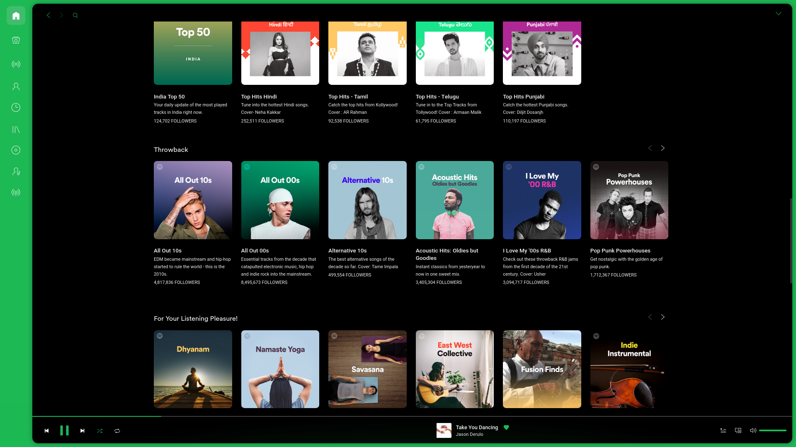
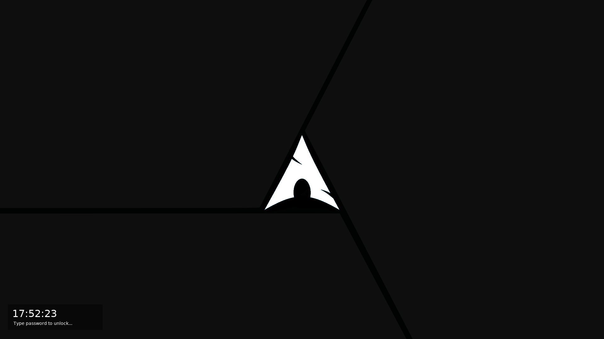

# Dotfiles

* OS: Arch Linux
* WM: i3-rounded-gaps
* Status Bar: polybar
* Menu: rofi
* Lock Screen: betterlockscreen

Custom theme is used for spotify using spicetify-cli

* Theme - [Dribbblish](https://github.com/morpheusthewhite/spicetify-themes/tree/master/Dribbblish)

## Installation

For installing all the packages and copying dotfiles in suitable location, run

```./install.sh```

> Add `backup.sh` script in `$HOME/scripts` folder else change the backup_dir in the script

## Screenshots





LockScreen
